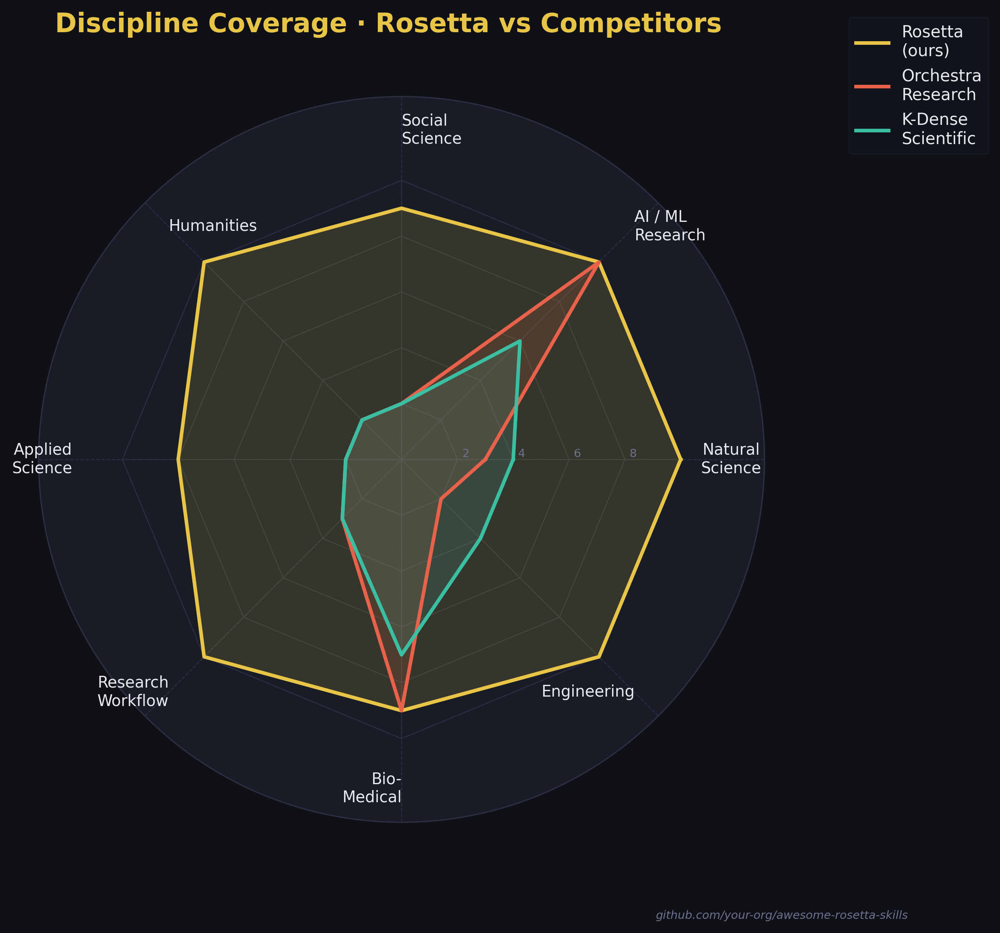
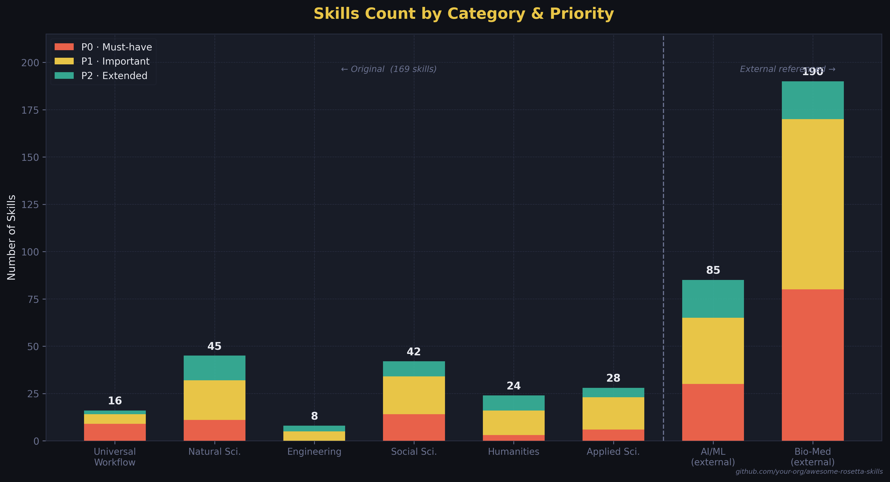
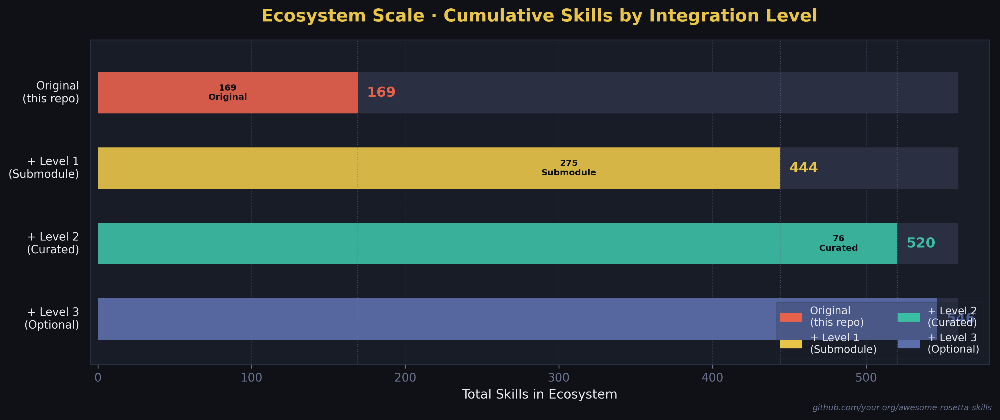

<div align="center">


# awesome-rosetta-skills

### The All-in-One Research Skills Library for AI Agents

**169 original skills · 24 disciplines · 510+ ecosystem · Every academic field**

*Physics → Chemistry → Economics → History → Linguistics → Public Health → Urban Science — and beyond*

---

[](LICENSE)
[](skills/)
[](skills/)
[](skills/)
[](CONTRIBUTING.md)
[](https://claude.ai/code)
[](https://openai.com/codex)
[](https://gemini.google.com)
[](https://cursor.sh)

</div>

📖 [中文版 README](README_ZH.md)

---

> **The existing Skills ecosystem has a blind spot.** Orchestra-Research covers AI/ML (85 skills). K-Dense covers biomedicine (170 skills). But what about the physicist modeling quantum systems? The economist running difference-in-differences? The historian mining digital archives? The linguist analyzing corpora?
>
> **awesome-rosetta-skills fills the gap** — a single repository that brings every academic discipline to your AI agent.

---

## Why "Rosetta"?

The Rosetta Stone was the key that unlocked communication across civilizations. This repository is the key that unlocks AI agent capabilities across all academic disciplines — a universal decoder for human knowledge.

---

## At a Glance

<div align="center">

|                         | awesome-rosetta-skills | Orchestra-Research |   K-Dense   |
| :---------------------- | :--------------------: | :----------------: | :---------: |
| **Original Skills**     |        **169**         |         85         |     170     |
| **Ecosystem Total**     |        **440+**        |         85         |     170     |
| **Disciplines Covered** |         **24**         |     1 (AI/ML)      | 3 (Bio-Med) |
| **Humanities**          |           ✅            |         ❌          |      ❌      |
| **Social Sciences**     |           ✅            |         ❌          |      ❌      |
| **Earth Sciences**      |           ✅            |         ❌          |   Partial   |
| **Engineering**         |           ✅            |         ❌          |      ❌      |
| **Platform Support**    |      5 platforms       |    5 platforms     | 3 platforms |

</div>

---

## Coverage Visuals

<div align="center">





</div>

---

## Discipline Index

> **169 original skills** across **24 disciplines** — plus **342 external skills** via Git Submodule (Orchestra-Research + K-Dense).
> Run `python scripts/generate_index.py --update-readme` to refresh counts.

<div align="center">

|   #   |       | Discipline                      | Skills | Directory                                            |
| :---: | :---: | :------------------------------ | :----: | :--------------------------------------------------- |
|  00   |   🔬   | Universal Research Workflow     |   16   | [00-universal](skills/00-universal/)                 |
|  01   |   ⚛️   | Physics                         |   11   | [01-physics](skills/01-physics/)                     |
|  02   |   🧪   | Chemistry                       |   8    | [02-chemistry](skills/02-chemistry/)                 |
|  03   |   📐   | Mathematics & Statistics        |   8    | [03-mathematics](skills/03-mathematics/)             |
|  04   |   🌍   | Earth & Environmental Science   |   11   | [04-earth-science](skills/04-earth-science/)         |
|  05   |   🧠   | Neuroscience                    |   7    | [05-neuroscience](skills/05-neuroscience/)           |
|  06   |   ⚙️   | Engineering                     |   8    | [06-engineering](skills/06-engineering/)             |
|  07   |   📊   | Economics                       |   12   | [07-economics](skills/07-economics/)                 |
|  08   |   💹   | Finance (Academic)              |   7    | [08-finance-academic](skills/08-finance-academic/)   |
|  09   |   🗳️   | Political Science               |   8    | [09-political-science](skills/09-political-science/) |
|  10   |   👥   | Sociology                       |   7    | [10-sociology](skills/10-sociology/)                 |
|  11   |   🧬   | Psychology                      |   8    | [11-psychology](skills/11-psychology/)               |
|  12   |   🗣️   | Linguistics                     |   6    | [12-linguistics](skills/12-linguistics/)             |
|  13   |   📜   | History                         |   6    | [13-history](skills/13-history/)                     |
|  14   |   💭   | Philosophy                      |   4    | [14-philosophy](skills/14-philosophy/)               |
|  15   |   🏺   | Archaeology                     |   4    | [15-archaeology](skills/15-archaeology/)             |
|  16   |   🎨   | Art & Musicology                |   4    | [16-art-music](skills/16-art-music/)                 |
|  17   |   🏥   | Public Health & Epidemiology    |   6    | [17-public-health](skills/17-public-health/)         |
|  18   |   🏙️   | Urban Science & Planning        |   5    | [18-urban-science](skills/18-urban-science/)         |
|  19   |   🌾   | Agriculture & Food Science      |   4    | [19-agriculture](skills/19-agriculture/)             |
|  20   |   📚   | Education                       |   4    | [20-education](skills/20-education/)                 |
|  21   |   🗂️   | Library Science & Bibliometrics |   5    | [21-library-science](skills/21-library-science/)     |
|  22   |   🔀   | Interdisciplinary Methods       |   4    | [22-interdisciplinary](skills/22-interdisciplinary/) |
|  23   |   ✍️   | Research Workflow               |   6    | [23-research-workflow](skills/23-research-workflow/) |

</div>

<details>
<summary><strong>📋 Full Skills List (43 launched · 169 on roadmap)</strong></summary>

<!-- SKILLS_INDEX_START -->

| Discipline      | Skill                                                                             | Description                                                                      |
| :-------------- | :-------------------------------------------------------------------------------- | :------------------------------------------------------------------------------- |
| 🔬 Universal     | [`literature-search`](skills/00-universal/literature-search/SKILL.md)             | Cross-database search: OpenAlex, Semantic Scholar, arXiv, deduplication, BibTeX  |
| 🔬 Universal     | [`statistical-testing`](skills/00-universal/statistical-testing/SKILL.md)         | Hypothesis testing: t-tests, ANOVA, non-parametric, effect sizes, FDR correction |
| 🔬 Universal     | [`experimental-design`](skills/00-universal/experimental-design/SKILL.md)         | Sample size, power analysis, randomization, pre-registration                     |
| 🔬 Universal     | [`data-visualization`](skills/00-universal/data-visualization/SKILL.md)           | Publication-quality figures: matplotlib/seaborn, ggplot2                         |
| 🔬 Universal     | [`scientometrics`](skills/00-universal/scientometrics/SKILL.md)                   | Bibliometrics: co-authorship networks, h-index, research fronts                  |
| 🔬 Universal     | [`rebuttal-writing`](skills/00-universal/rebuttal-writing/SKILL.md)               | Peer-review rebuttal: point-by-point format, tone, LaTeX template                |
| ⚛️ Physics       | [`scipy-numerical`](skills/01-physics/scipy-numerical/SKILL.md)                   | ODE/PDE solving, FFT, optimization, sparse linear algebra                        |
| ⚛️ Physics       | [`sympy-symbolic`](skills/01-physics/sympy-symbolic/SKILL.md)                     | Symbolic computation: calculus, mechanics, quantum physics                       |
| 🧪 Chemistry     | [`ase-atomistic`](skills/02-chemistry/ase-atomistic/SKILL.md)                     | ASE: structure building, geometry optimization, NEB, MD                          |
| 📐 Mathematics   | [`bayesian-stats`](skills/03-mathematics/bayesian-stats/SKILL.md)                 | Bayesian inference: PyMC 5.x, NUTS, diagnostics, LOO-CV                          |
| 📐 Mathematics   | [`causal-inference`](skills/03-mathematics/causal-inference/SKILL.md)             | DoWhy: DAGs, backdoor criterion, propensity matching                             |
| 🌍 Earth Science | [`era5-climate`](skills/04-earth-science/era5-climate/SKILL.md)                   | ERA5 reanalysis: CDS API, xarray, anomalies, trend analysis                      |
| 🌍 Earth Science | [`geopandas-gis`](skills/04-earth-science/geopandas-gis/SKILL.md)                 | Vector GIS: spatial joins, overlay, choropleth maps                              |
| 🧠 Neuroscience  | [`mne-eeg`](skills/05-neuroscience/mne-eeg/SKILL.md)                              | EEG/MEG: preprocessing, ICA, ERP, time-frequency analysis                        |
| 🧠 Neuroscience  | [`nilearn-fmri`](skills/05-neuroscience/nilearn-fmri/SKILL.md)                    | fMRI: GLM, resting-state connectivity, MVPA decoding                             |
| ⚙️ Engineering   | [`signal-processing`](skills/06-engineering/signal-processing/SKILL.md)           | DSP: filter design, spectrogram, Welch PSD, peak detection                       |
| 📊 Economics     | [`ols-regression`](skills/07-economics/ols-regression/SKILL.md)                   | OLS: heteroscedasticity tests, robust SE, regression tables                      |
| 📊 Economics     | [`did-causal`](skills/07-economics/did-causal/SKILL.md)                           | DID: TWFE, parallel trends, Callaway-Sant'Anna, Bacon decomposition              |
| 📊 Economics     | [`rdd-design`](skills/07-economics/rdd-design/SKILL.md)                           | RDD: rdrobust, bandwidth selection, McCrary test, RD plots                       |
| 📊 Economics     | [`iv-2sls`](skills/07-economics/iv-2sls/SKILL.md)                                 | IV/2SLS: first-stage F-stat, Wu-Hausman, Sargan-Hansen test                      |
| 📊 Economics     | [`fred-macro`](skills/07-economics/fred-macro/SKILL.md)                           | FRED API: GDP, unemployment, CPI, HP filter, recession shading                   |
| 📊 Economics     | [`panel-data`](skills/07-economics/panel-data/SKILL.md)                           | Panel: FE/RE, Hausman, Arellano-Bond GMM, unit root tests                        |
| 💹 Finance       | [`factor-models`](skills/08-finance-academic/factor-models/SKILL.md)              | Asset pricing: Fama-French 3/5-factor, alpha, GRS test                           |
| 💹 Finance       | [`event-study`](skills/08-finance-academic/event-study/SKILL.md)                  | Event study: abnormal returns, CAR/BHAR, BMP test                                |
| 🗳️ Poli. Sci.    | [`vdem-analysis`](skills/09-political-science/vdem-analysis/SKILL.md)             | V-Dem: democracy indices, panel regression, backsliding                          |
| 🗳️ Poli. Sci.    | [`text-as-data`](skills/09-political-science/text-as-data/SKILL.md)               | Political text: Wordfish, LDA, sentiment, ideology scaling                       |
| 👥 Sociology     | [`social-network-analysis`](skills/10-sociology/social-network-analysis/SKILL.md) | NetworkX: centrality, community detection, Gephi export                          |
| 👥 Sociology     | [`computational-sociology`](skills/10-sociology/computational-sociology/SKILL.md) | Social media APIs, bot detection, echo chamber analysis                          |
| 🧬 Psychology    | [`power-analysis`](skills/11-psychology/power-analysis/SKILL.md)                  | Statistical power: t-test, ANOVA, regression, mediation sim                      |
| 🧬 Psychology    | [`psychometrics`](skills/11-psychology/psychometrics/SKILL.md)                    | CTT, EFA/CFA, IRT 2PL, measurement invariance, DIF                               |
| 🗣️ Linguistics   | [`corpus-linguistics`](skills/12-linguistics/corpus-linguistics/SKILL.md)         | Frequency, MI/log-likelihood collocations, KWIC concordance                      |
| 📜 History       | [`digital-archives`](skills/13-history/digital-archives/SKILL.md)                 | Europeana, Chronicling America, Internet Archive APIs                            |
| 💭 Philosophy    | [`sep-literature`](skills/14-philosophy/sep-literature/SKILL.md)                  | SEP scraping, PhilPapers API, concept genealogy tracing                          |
| 🏺 Archaeology   | [`radiocarbon-dating`](skills/15-archaeology/radiocarbon-dating/SKILL.md)         | ¹⁴C calibration: IntCal20, Bayesian sequence modeling                            |
| 🎨 Art & Music   | [`librosa-audio`](skills/16-art-music/librosa-audio/SKILL.md)                     | MIR: tempo, chroma, MFCCs, onset detection, similarity                           |
| 🏥 Public Health | [`epi-modeling`](skills/17-public-health/epi-modeling/SKILL.md)                   | SEIR/SIR modeling, Rt estimation, parameter fitting                              |
| 🏥 Public Health | [`global-health-data`](skills/17-public-health/global-health-data/SKILL.md)       | WHO/IHME: DALYs, age-standardization, health inequality                          |
| 🏙️ Urban Sci.    | [`osmnx-urban`](skills/18-urban-science/osmnx-urban/SKILL.md)                     | OSMnx: walkability, centrality, isochrones, city comparisons                     |
| 🌾 Agriculture   | [`soil-data`](skills/19-agriculture/soil-data/SKILL.md)                           | SoilGrids API, SOC stocks, texture classification                                |
| 📚 Education     | [`edm-learning-analytics`](skills/20-education/edm-learning-analytics/SKILL.md)   | BKT knowledge tracing, dropout prediction, learning curves                       |
| 🗂️ Library Sci.  | [`topic-modeling-lit`](skills/21-library-science/topic-modeling-lit/SKILL.md)     | LDA + BERTopic on abstracts, coherence, temporal trends                          |
| 🔀 Interdiscip.  | [`complexity-science`](skills/22-interdisciplinary/complexity-science/SKILL.md)   | Power laws, Hurst exponent, fractal dimension, ABM                               |
| ✍️ Workflow      | [`latex-workflow`](skills/23-research-workflow/latex-workflow/SKILL.md)           | LaTeX: packages, Makefile, bibliography, arXiv submission                        |

<!-- SKILLS_INDEX_END -->

</details>

---

## Ecosystem

This repository is the **hub** of a broader 510+ skills ecosystem:

```
awesome-rosetta-skills (169 original)
├── external/orchestra-ai-research    ← 85 AI/ML skills  [git submodule]
├── external/kdense-scientific        ← 170 biomedicine skills  [git submodule]
└── external/kdense-writer            ← 20 scientific writing skills  [git submodule]
```

<div align="center">

| Integration Level           |     Skills     | Description                                  |
| :-------------------------- | :------------: | :------------------------------------------- |
| 🔴 **Original** (this repo)  |      169       | 24 disciplines, fills every ecosystem gap    |
| 🟡 **+ Level 1** (Submodule) | +342 → **511** | Orchestra-Research + K-Dense, auto-synced    |
| 🟢 **+ Level 2** (Curated)   | +76 → **520**  | Medical devices, materials simulation, legal |
| ⚪ **+ Level 3** (Optional)  | +26 → **546**  | Finance tools, context engineering           |

</div>

---

## Installation

### Method A · Git Clone + Install Script (Recommended)

```bash
# 1. Clone the repository (with all external submodules)
git clone --depth=1 https://github.com/xjtulyc/awesome-rosetta-skills.git
cd awesome-rosetta-skills
git submodule update --init --recursive   # pulls Orchestra-Research + K-Dense (~342 external skills)

# 2a. Install all skills to Claude Code (auto-detected)
bash scripts/install.sh

# 2b. Install for a specific agent
bash scripts/install.sh --agent claude-code
bash scripts/install.sh --agent codex
bash scripts/install.sh --agent gemini-cli
bash scripts/install.sh --agent cursor

# 2c. Install a single discipline
bash scripts/install.sh --category economics
bash scripts/install.sh --category physics
bash scripts/install.sh --category neuroscience

# 2d. Preview without installing
bash scripts/install.sh --dry-run
bash scripts/install.sh --list          # show all available disciplines
```

### Method B · Manual Copy

```bash
git clone --depth=1 https://github.com/xjtulyc/awesome-rosetta-skills.git
cd awesome-rosetta-skills
git submodule update --init --recursive

# Copy all skills to Claude Code
cp -r skills/* ~/.claude/skills/

# Or copy a specific discipline only
cp -r skills/07-economics/* ~/.claude/skills/
cp -r skills/00-universal/* ~/.claude/skills/
```

### Platform Path Reference

| Platform        | Skills Path         | Format               |
| :-------------- | :------------------ | :------------------- |
| Claude Code     | `~/.claude/skills/` | SKILL.md             |
| OpenAI Codex    | `~/.codex/skills/`  | SKILL.md             |
| Gemini CLI      | `~/.gemini/skills/` | SKILL.md             |
| Cursor          | `.cursor/rules/`    | MDC (auto-converted) |
| VS Code Copilot | `.github/skills/`   | SKILL.md             |

---

## Quality Standard

Every skill in this repository must meet the following bar before merging:

- **≥ 300 lines** of actionable guidance
- **2+ real, runnable code examples** (no pseudocode)
- **Explicit trigger description** so the agent knows exactly when to invoke it
- **Dependency pinning** — every package has a version constraint
- **CI passing** — automated format, link, and duplication checks

See [SKILL_STANDARD.md](SKILL_STANDARD.md) for the complete specification.

---

## Roadmap

| Milestone       | Timeline | Target                              |
| :-------------- | :------- | :---------------------------------- |
| 🔴 **MVP**       | Week 6   | 70 original skills · 10 disciplines |
| 🟡 **Beta**      | Week 10  | 130 skills · 20 disciplines         |
| 🟢 **v1.0**      | Week 16  | 200 skills · all 24 disciplines     |
| ⭐ **Community** | Month 6  | 300+ skills · 50+ contributors      |

---

## Contributing

New to skills? Start here:

```bash
cp templates/SKILL_TEMPLATE.md skills/YOUR_DISCIPLINE/your-skill-name/SKILL.md
# Edit the template, then open a PR
```

Read [CONTRIBUTING.md](CONTRIBUTING.md) for the full guide.
Domain experts welcome — if you know a field well, your contribution fills a gap no one else can.

---

## External References

Pulled via Git Submodule — no content duplicated, upstream changes sync automatically:

| Repository                                                                                        | Coverage                     | Skills |
| :------------------------------------------------------------------------------------------------ | :--------------------------- | :----: |
| [Orchestra-Research/AI-Research-SKILLs](https://github.com/Orchestra-Research/AI-Research-SKILLs) | AI/ML research engineering   |   85   |
| [K-Dense-AI/claude-scientific-skills](https://github.com/K-Dense-AI/claude-scientific-skills)     | Biomedicine & life sciences  |  170   |
| [K-Dense-AI/claude-scientific-writer](https://github.com/K-Dense-AI/claude-scientific-writer)     | Scientific writing workflows |   20   |

```bash
git submodule update --init --recursive   # first time
git submodule update --remote             # sync to latest
```

---

## License

[MIT License](LICENSE) · External submodules retain their own licenses.

---

<div align="center">

**[💬 Discussions](https://github.com/xjtulyc/awesome-rosetta-skills/discussions) · [🐛 Issues](https://github.com/xjtulyc/awesome-rosetta-skills/issues) · [📖 Docs](https://xjtulyc.github.io/awesome-rosetta-skills)**

<br/>

*awesome-rosetta-skills — Bridging AI agents with the full breadth of human knowledge*

</div>
