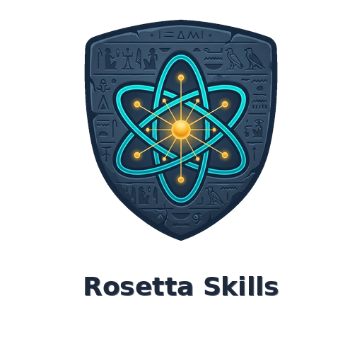
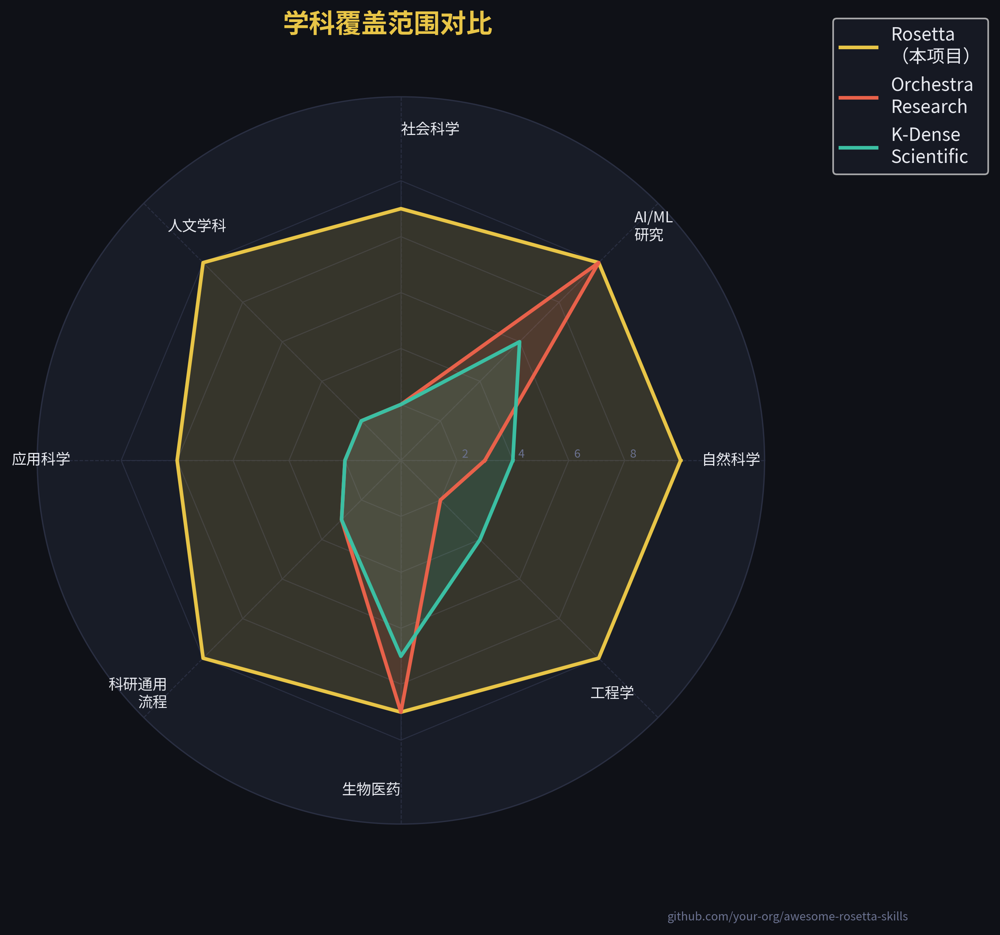
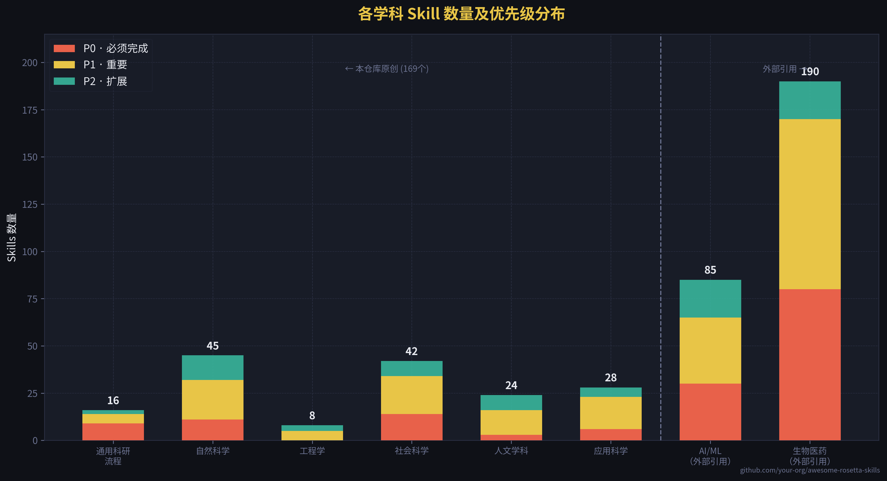
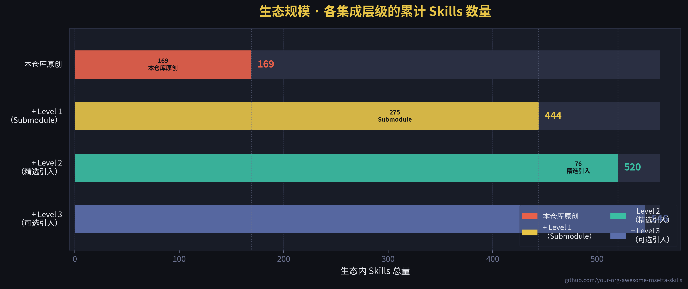

<div align="center">



# awesome-rosetta-skills

### 面向 AI Agent 的全学科一站式科研 Skills 库

**169 个原创 Skills · 24 个学科 · 510+ 生态总量 · 覆盖所有学术领域**

*物理 → 化学 → 经济学 → 历史 → 语言学 → 公共卫生 → 城市科学 → ……无所不包*

---

[](LICENSE)
[](skills/)
[](skills/)
[](skills/)
[](CONTRIBUTING.md)
[](https://claude.ai/code)
[](https://openai.com/codex)
[](https://gemini.google.com)
[](https://cursor.sh)

</div>

📖 [English README](README.md)

---

> **现有 Skills 生态存在巨大盲区。** Orchestra-Research 覆盖 AI/ML（85个Skills），K-Dense 覆盖生物医药（170个Skills）。但那些用量子模拟研究物理的研究者呢？跑双重差分的经济学家呢？挖掘数字档案的历史学家呢？分析语料库的语言学家呢？
>
> **awesome-rosetta-skills 填补了这个空白** —— 一个仓库，把所有学术学科的专业能力交给你的 AI Agent。

---

## 为什么叫 "Rosetta"？

罗塞塔石碑是解码人类文明跨语言交流的钥匙。这个仓库是解码所有学术学科的钥匙 —— 一个通用解码器，让 AI Agent 读懂人类知识的全部语言。

---

## 一眼看懂

<div align="center">

|                    | awesome-rosetta-skills | Orchestra-Research |    K-Dense    |
| :----------------- | :--------------------: | :----------------: | :-----------: |
| **原创 Skills 数** |        **169**         |         85         |      170      |
| **生态总量**       |        **440+**        |         85         |      170      |
| **覆盖学科数**     |         **24**         |     1（AI/ML）     | 3（生物医药） |
| **人文学科**       |           ✅            |         ❌          |       ❌       |
| **社会科学**       |           ✅            |         ❌          |       ❌       |
| **地球科学**       |           ✅            |         ❌          |     部分      |
| **工程学**         |           ✅            |         ❌          |       ❌       |
| **支持平台数**     |          5 个          |        5 个        |     3 个      |

</div>

---

## 覆盖范围可视化

<div align="center">





</div>

---

## 学科索引

> **24 个学科分类，169 个原创 Skills** —— 另有 **342 个外部 Skills**（Git Submodule，Orchestra-Research + K-Dense）。
> 运行 `python scripts/generate_index.py --update-readme` 刷新数量统计。

<div align="center">

|   #   |       | 学科               | Skills 数 | 目录                                                 |
| :---: | :---: | :----------------- | :-------: | :--------------------------------------------------- |
|  00   |   🔬   | 通用科研工作流     |    16     | [00-universal](skills/00-universal/)                 |
|  01   |   ⚛️   | 物理学             |    11     | [01-physics](skills/01-physics/)                     |
|  02   |   🧪   | 化学               |     8     | [02-chemistry](skills/02-chemistry/)                 |
|  03   |   📐   | 数学与统计         |     8     | [03-mathematics](skills/03-mathematics/)             |
|  04   |   🌍   | 地球与环境科学     |    11     | [04-earth-science](skills/04-earth-science/)         |
|  05   |   🧠   | 神经科学           |     7     | [05-neuroscience](skills/05-neuroscience/)           |
|  06   |   ⚙️   | 工程学             |     8     | [06-engineering](skills/06-engineering/)             |
|  07   |   📊   | 经济学             |    12     | [07-economics](skills/07-economics/)                 |
|  08   |   💹   | 金融学（学术向）   |     7     | [08-finance-academic](skills/08-finance-academic/)   |
|  09   |   🗳️   | 政治学             |     8     | [09-political-science](skills/09-political-science/) |
|  10   |   👥   | 社会学             |     7     | [10-sociology](skills/10-sociology/)                 |
|  11   |   🧬   | 心理学             |     8     | [11-psychology](skills/11-psychology/)               |
|  12   |   🗣️   | 语言学             |     6     | [12-linguistics](skills/12-linguistics/)             |
|  13   |   📜   | 历史学             |     6     | [13-history](skills/13-history/)                     |
|  14   |   💭   | 哲学               |     4     | [14-philosophy](skills/14-philosophy/)               |
|  15   |   🏺   | 考古学             |     4     | [15-archaeology](skills/15-archaeology/)             |
|  16   |   🎨   | 艺术学与音乐学     |     4     | [16-art-music](skills/16-art-music/)                 |
|  17   |   🏥   | 公共卫生与流行病学 |     6     | [17-public-health](skills/17-public-health/)         |
|  18   |   🏙️   | 城市科学与规划     |     5     | [18-urban-science](skills/18-urban-science/)         |
|  19   |   🌾   | 农业与食品科学     |     4     | [19-agriculture](skills/19-agriculture/)             |
|  20   |   📚   | 教育学             |     4     | [20-education](skills/20-education/)                 |
|  21   |   🗂️   | 图书馆学与文献计量 |     5     | [21-library-science](skills/21-library-science/)     |
|  22   |   🔀   | 跨学科方法         |     4     | [22-interdisciplinary](skills/22-interdisciplinary/) |
|  23   |   ✍️   | 科研通用流程       |     6     | [23-research-workflow](skills/23-research-workflow/) |

</div>

<details>
<summary><strong>📋 完整 Skills 列表（已发布 43 个 · 路线图 169 个）</strong></summary>

<!-- SKILLS_INDEX_START -->

| 学科        | Skill                                                                             | 功能描述                                                           |
| :---------- | :-------------------------------------------------------------------------------- | :----------------------------------------------------------------- |
| 🔬 通用      | [`literature-search`](skills/00-universal/literature-search/SKILL.md)             | 跨库文献检索：OpenAlex、Semantic Scholar、arXiv、去重、BibTeX 导出 |
| 🔬 通用      | [`statistical-testing`](skills/00-universal/statistical-testing/SKILL.md)         | 假设检验：t 检验、ANOVA、非参数、效应量、FDR 校正                  |
| 🔬 通用      | [`experimental-design`](skills/00-universal/experimental-design/SKILL.md)         | 样本量计算、效能分析、随机化策略、预注册流程                       |
| 🔬 通用      | [`data-visualization`](skills/00-universal/data-visualization/SKILL.md)           | 出版级图表：matplotlib/seaborn、ggplot2 规范                       |
| 🔬 通用      | [`scientometrics`](skills/00-universal/scientometrics/SKILL.md)                   | 文献计量：合作网络、h 指数、研究前沿、OpenAlex API                 |
| 🔬 通用      | [`rebuttal-writing`](skills/00-universal/rebuttal-writing/SKILL.md)               | 审稿回复：逐点回应格式、语气控制、LaTeX 模板                       |
| ⚛️ 物理      | [`scipy-numerical`](skills/01-physics/scipy-numerical/SKILL.md)                   | ODE/PDE 求解、FFT、数值优化、稀疏线性代数                          |
| ⚛️ 物理      | [`sympy-symbolic`](skills/01-physics/sympy-symbolic/SKILL.md)                     | 符号计算：微积分、力学、量子物理、代码生成                         |
| 🧪 化学      | [`ase-atomistic`](skills/02-chemistry/ase-atomistic/SKILL.md)                     | ASE：结构搭建、几何优化、NEB 过渡态、分子动力学                    |
| 📐 数学      | [`bayesian-stats`](skills/03-mathematics/bayesian-stats/SKILL.md)                 | 贝叶斯推断：PyMC 5.x、NUTS、收敛诊断、LOO-CV                       |
| 📐 数学      | [`causal-inference`](skills/03-mathematics/causal-inference/SKILL.md)             | 因果推断：DoWhy、DAG、后门准则、倾向评分匹配                       |
| 🌍 地球科学  | [`era5-climate`](skills/04-earth-science/era5-climate/SKILL.md)                   | ERA5 再分析：CDS API、xarray、气候异常、趋势分析                   |
| 🌍 地球科学  | [`geopandas-gis`](skills/04-earth-science/geopandas-gis/SKILL.md)                 | 矢量 GIS：空间连接、叠加分析、分级设色地图                         |
| 🧠 神经科学  | [`mne-eeg`](skills/05-neuroscience/mne-eeg/SKILL.md)                              | EEG/MEG：预处理、ICA 伪迹去除、ERP、时频分析                       |
| 🧠 神经科学  | [`nilearn-fmri`](skills/05-neuroscience/nilearn-fmri/SKILL.md)                    | fMRI：GLM、静息态连接、MVPA 解码、脑图可视化                       |
| ⚙️ 工程      | [`signal-processing`](skills/06-engineering/signal-processing/SKILL.md)           | DSP：滤波器设计、时频谱图、Welch PSD、峰值检测                     |
| 📊 经济学    | [`ols-regression`](skills/07-economics/ols-regression/SKILL.md)                   | OLS：异方差检验、鲁棒标准误、回归汇总表                            |
| 📊 经济学    | [`did-causal`](skills/07-economics/did-causal/SKILL.md)                           | 双重差分：TWFE、平行趋势检验、Callaway-Sant'Anna                   |
| 📊 经济学    | [`rdd-design`](skills/07-economics/rdd-design/SKILL.md)                           | 断点回归：rdrobust、带宽选择、McCrary 操纵检验                     |
| 📊 经济学    | [`iv-2sls`](skills/07-economics/iv-2sls/SKILL.md)                                 | 工具变量：首阶段 F 统计、Wu-Hausman、Sargan-Hansen                 |
| 📊 经济学    | [`fred-macro`](skills/07-economics/fred-macro/SKILL.md)                           | FRED API：GDP、失业率、CPI、HP 滤波、衰退阴影                      |
| 📊 经济学    | [`panel-data`](skills/07-economics/panel-data/SKILL.md)                           | 面板数据：固定/随机效应、Hausman、Arellano-Bond GMM                |
| 💹 金融      | [`factor-models`](skills/08-finance-academic/factor-models/SKILL.md)              | 资产定价：Fama-French 三/五因子、Alpha、GRS 检验                   |
| 💹 金融      | [`event-study`](skills/08-finance-academic/event-study/SKILL.md)                  | 事件研究：超额收益、CAR/BHAR、BMP 检验                             |
| 🗳️ 政治学    | [`vdem-analysis`](skills/09-political-science/vdem-analysis/SKILL.md)             | V-Dem 民主指数：面板回归、民主倒退检测                             |
| 🗳️ 政治学    | [`text-as-data`](skills/09-political-science/text-as-data/SKILL.md)               | 政治文本：Wordfish 测量、LDA、情感、意识形态分类                   |
| 👥 社会学    | [`social-network-analysis`](skills/10-sociology/social-network-analysis/SKILL.md) | NetworkX：中心性、社区发现、Gephi 导出                             |
| 👥 社会学    | [`computational-sociology`](skills/10-sociology/computational-sociology/SKILL.md) | 社交媒体 API、机器人检测、回音室分析                               |
| 🧬 心理学    | [`power-analysis`](skills/11-psychology/power-analysis/SKILL.md)                  | 统计效能：t 检验、ANOVA、回归、中介效应模拟                        |
| 🧬 心理学    | [`psychometrics`](skills/11-psychology/psychometrics/SKILL.md)                    | 量表开发：CTT、EFA/CFA、IRT 2PL、测量不变性                        |
| 🗣️ 语言学    | [`corpus-linguistics`](skills/12-linguistics/corpus-linguistics/SKILL.md)         | 词频、MI/对数似然共现、KWIC 索引                                   |
| 📜 历史学    | [`digital-archives`](skills/13-history/digital-archives/SKILL.md)                 | Europeana、Chronicling America、Internet Archive API               |
| 💭 哲学      | [`sep-literature`](skills/14-philosophy/sep-literature/SKILL.md)                  | SEP 抓取、PhilPapers API、概念谱系追踪                             |
| 🏺 考古学    | [`radiocarbon-dating`](skills/15-archaeology/radiocarbon-dating/SKILL.md)         | ¹⁴C 定年：IntCal20 校准、贝叶斯序列建模                            |
| 🎨 艺术/音乐 | [`librosa-audio`](skills/16-art-music/librosa-audio/SKILL.md)                     | 音乐信息检索：节拍、色度、MFCC、起始检测                           |
| 🏥 公共卫生  | [`epi-modeling`](skills/17-public-health/epi-modeling/SKILL.md)                   | SEIR/SIR 建模、Rt 估计、参数拟合                                   |
| 🏥 公共卫生  | [`global-health-data`](skills/17-public-health/global-health-data/SKILL.md)       | WHO/IHME：DALYs、年龄标准化、健康不平等                            |
| 🏙️ 城市科学  | [`osmnx-urban`](skills/18-urban-science/osmnx-urban/SKILL.md)                     | OSMnx：步行性、中心性、等时圈、城市比较                            |
| 🌾 农业      | [`soil-data`](skills/19-agriculture/soil-data/SKILL.md)                           | SoilGrids API、土壤有机碳、质地分类                                |
| 📚 教育学    | [`edm-learning-analytics`](skills/20-education/edm-learning-analytics/SKILL.md)   | BKT 知识追踪、辍学预测、学习曲线分析                               |
| 🗂️ 图情      | [`topic-modeling-lit`](skills/21-library-science/topic-modeling-lit/SKILL.md)     | LDA + BERTopic 文献摘要话题建模、时序趋势                          |
| 🔀 跨学科    | [`complexity-science`](skills/22-interdisciplinary/complexity-science/SKILL.md)   | 幂律、Hurst 指数、分形维度、Agent-Based 建模                       |
| ✍️ 科研流程  | [`latex-workflow`](skills/23-research-workflow/latex-workflow/SKILL.md)           | LaTeX：宏包配置、Makefile、参考文献、arXiv 投稿                    |

<!-- SKILLS_INDEX_END -->

</details>

---

## 生态体系

本仓库是整个 510+ Skills 生态的**枢纽**：

```
awesome-rosetta-skills（169 个原创）
├── external/orchestra-ai-research    ← 85 个 AI/ML Skills  [git submodule]
├── external/kdense-scientific        ← 170 个生物医药 Skills  [git submodule]
└── external/kdense-writer            ← 20 个科学写作 Skills  [git submodule]
```

<div align="center">

| 集成层级                     |   Skills 数    | 说明                                       |
| :--------------------------- | :------------: | :----------------------------------------- |
| 🔴 **本仓库原创**             |      169       | 24 个学科，填补所有生态空白                |
| 🟡 **+ Level 1**（Submodule） | +342 → **511** | Orchestra-Research + K-Dense，自动同步上游 |
| 🟢 **+ Level 2**（精选引入）  | +76 → **520**  | 医疗器械、材料模拟、法律研究               |
| ⚪ **+ Level 3**（可选）      | +26 → **546**  | 金融工具、Context Engineering              |

</div>

---

## 安装方式

### 方式 A · Git 克隆 + 安装脚本（推荐）

```bash
# 1. 克隆仓库（含全部外部子模块）
git clone --depth=1 https://github.com/xjtulyc/awesome-rosetta-skills.git
cd awesome-rosetta-skills
git submodule update --init --recursive   # 拉取 Orchestra-Research + K-Dense（约 342 个外部 Skills）

# 2a. 自动检测 Agent 并安装全部 Skills
bash scripts/install.sh

# 2b. 指定 Agent 平台
bash scripts/install.sh --agent claude-code
bash scripts/install.sh --agent codex
bash scripts/install.sh --agent gemini-cli
bash scripts/install.sh --agent cursor

# 2c. 只安装某个学科
bash scripts/install.sh --category economics
bash scripts/install.sh --category physics
bash scripts/install.sh --category neuroscience

# 2d. 预览（不实际安装）
bash scripts/install.sh --dry-run
bash scripts/install.sh --list          # 查看所有可用学科
```

### 方式 B · 手动复制

```bash
git clone --depth=1 https://github.com/xjtulyc/awesome-rosetta-skills.git
cd awesome-rosetta-skills
git submodule update --init --recursive

# 全部复制到 Claude Code
cp -r skills/* ~/.claude/skills/

# 或只复制某个学科
cp -r skills/07-economics/* ~/.claude/skills/
cp -r skills/00-universal/* ~/.claude/skills/
```

### 各平台路径参考

| 平台            | Skills 路径                    | 加载方式 |
| :-------------- | :----------------------------- | :------- |
| Claude Code     | `~/.claude/skills/`            | 自动发现 |
| OpenAI Codex    | `~/.codex/skills/`             | 自动发现 |
| Gemini CLI      | `~/.gemini/skills/`            | 自动发现 |
| Cursor          | `.cursor/rules/`（需格式转换） | MDC 格式 |
| VS Code Copilot | `.github/skills/`              | 自动发现 |

---

## 质量标准

本仓库每个 Skill 合并前必须满足：

- **≥ 300 行**有效指导内容
- **至少 2 个真实可执行的代码示例**（禁止伪代码）
- **明确的触发描述**，让 Agent 知道何时调用
- **依赖版本锁定**，每个包都有版本约束
- **CI 全通过**：格式、链接有效性、重复度自动检验

完整规范见 [SKILL_STANDARD.md](SKILL_STANDARD.md)。

---

## 路线图

| 里程碑       | 时间节点  | 目标                              |
| :----------- | :-------- | :-------------------------------- |
| 🔴 **MVP**    | 第 6 周   | 70 个原创 Skills · 覆盖 10 个学科 |
| 🟡 **Beta**   | 第 10 周  | 130 个 Skills · 覆盖 20 个学科    |
| 🟢 **v1.0**   | 第 16 周  | 200 个 Skills · 24 个学科全覆盖   |
| ⭐ **社区版** | 第 6 个月 | 300+ Skills · 50+ 贡献者          |

---

## 如何贡献

首次贡献者请从模板开始：

```bash
cp templates/SKILL_TEMPLATE.md skills/你的学科/skill-name/SKILL.md
# 填写模板，然后提交 PR
```

完整贡献指南见 [CONTRIBUTING.md](CONTRIBUTING.md)。
**欢迎各领域专家参与** —— 你的专业背景是其他人无法替代的。

---

## 外部引用来源

通过 Git Submodule 接入，不复制任何内容，上游更新自动同步：

| 仓库                                                                                              | 覆盖领域           | Skills 数 |
| :------------------------------------------------------------------------------------------------ | :----------------- | :-------: |
| [Orchestra-Research/AI-Research-SKILLs](https://github.com/Orchestra-Research/AI-Research-SKILLs) | AI/ML 研究工程     |    85     |
| [K-Dense-AI/claude-scientific-skills](https://github.com/K-Dense-AI/claude-scientific-skills)     | 生物医药与生命科学 |    170    |
| [K-Dense-AI/claude-scientific-writer](https://github.com/K-Dense-AI/claude-scientific-writer)     | 科学写作工作流     |    20     |

```bash
git submodule update --init --recursive   # 首次初始化
git submodule update --remote             # 同步上游最新版本
```

---

## 许可证

[MIT 许可证](LICENSE) · 外部子模块保留各自的许可证。

---

<div align="center">

**[💬 社区讨论](https://github.com/xjtulyc/awesome-rosetta-skills/discussions) · [🐛 提 Issue](https://github.com/xjtulyc/awesome-rosetta-skills/issues) · [📖 文档](https://xjtulyc.github.io/awesome-rosetta-skills)**

<br/>

*awesome-rosetta-skills —— 让 AI Agent 读懂人类知识的全部语言*

</div>
